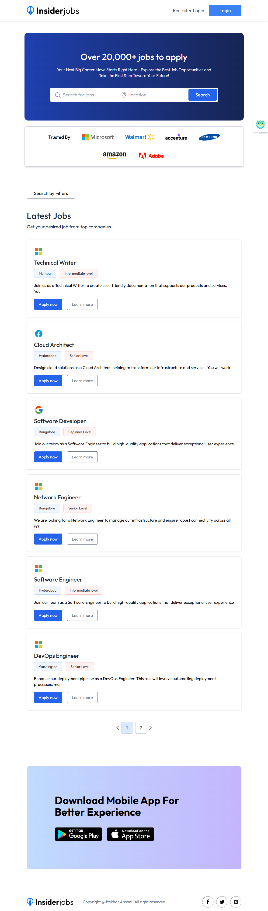

# 🧑‍💼 Full Stack Job Portal Website - Insider Jobs

A fully functional **Job Listing and Job Searching platform** built with the **MERN stack** (MongoDB, Express, React, Node.js). This platform enables **job seekers** to search and apply for job openings and allows **recruiters** to manage job posts and applications. 

---


[](https://job-portal-new-client-olive.vercel.app/)


## 🚀 Features
 
### 👨‍💻 Job Seekers 
- 📃 Login and Sign up through clerk authentication
- 🔍 Search for job openings by title, location, or category
- 📝 Apply to jobs directly from the portal
- 📂 Upload and manage resume on user profile
- 🔐 User Authentication via [Clerk](https://clerk.dev)

### 🧑‍💼 Recruiters Dashboard
- 🪪 Login and Register (using jwt)
-    Password reset by sending reset link to email
- ➕ Post new job listings
- 📋 View and manage existing job posts
- ✅ Accept or ❌ Reject job applications
- 👁️‍🗨️ View applicants' resumes

### ⚙️ System Integrations
- 📊 **Sentry** for:
  - Real-time error tracking
  - Performance monitoring
  - MongoDB query tracing for performance optimization

### 🌐 Deployment
- ✅ Deployed on [Vercel](https://vercel.com)

---

## 🧰 Tech Stack

| Tech | Description |
|------|-------------|
| **Frontend** | React, Tailwind CSS |
| **Backend** | Node.js, Express.js |
| **Database** | MongoDB (Mongoose) |
| **Authentication** | Clerk (Job Seekers), JWT (Recruiters) |
| **Monitoring** | Sentry |
| **Deployment** | Vercel |
| **File Storage** | Cloudinary (Images, PDFs) |


---

## 🛠️ Setup Instructions

1. **Clone the Repository**
   ```bash
   git clone https://github.com/iftekharansari2003/Job-Portal.git
   
2. **Install Dependencies**
   ```bash
   # For both frontend and backend
   npm install
   
3. **Set Environment Variables**
    - Create a ```.env ``` file in the client and server directory and add required env variable
      
      ```env
      MONGO_URI=your_mongodb_connection_string
      CLERK_SECRET_KEY=your_clerk_secret
      CLERK_PUBLISHABLE_KEY=your_clerk_frontend_key #for frontend
      SENTRY_DSN=your_sentry_dsn


4. **Run the App Locally**
   ```bash
   # For frontend 
   cd client
   npm run dev

   # For backend 
   cd server
   npm run server
   
5. **☁️ Cloudinary Integration**
   
   This app uses [Cloudinary](https://cloudinary.com/) for:

   - 📸 Storing company logos/profile images.
   - 📄 Uploading and accessing resume PDFs.
   - The backend uses cloudinary and multer to handle secure file uploads. Uploaded files are stored in your Cloudinary media library and can be accessed via their        secure URLs.
  
     Ensure you add your Cloudinary credentials to your `.env`:
      ```
        CLOUDINARY_CLOUD_NAME=your_cloud_name
        CLOUDINARY_API_KEY=your_api_key
        CLOUDINARY_API_SECRET=your_api_secret
      ```
  ---
  
  ## 🔐 JWT Authentication for Recruiters

  While **job seekers** use Clerk for authentication, **recruiters** are authenticated using **JWT (JSON Web Tokens)**.

  ### 🔧 How It Works:
  
  - Recruiters sign up or log in using a custom login form.
  - On successful login, the server generates a **JWT** containing the recruiter ID and signs it using a secret key.
  - This token is sent to the client and stored (usually in HTTP-only cookies or local storage).
  - All protected recruiter routes (like posting jobs, viewing applicants, etc.) require this token for access.

  ### 🔐 Environment Variables

  In your `.env` file, define the following:

  ```
  JWT_SECRET=your_jwt_secret_key
  JWT_EXPIRES_IN=7d
  ```
---

## 🔐 Clerk Authentication for Job Seekers

Job Seekers(users) are authenticated using **[Clerk](https://clerk.dev)** – a developer-first authentication platform that provides pre-built and secure user sign-in and sign-up flows.

In general, Clerk  handles:

- 📧 Email/password login
- 🔗 Magic link sign-in
- 🌐 Social logins (Google, GitHub, etc.)
- 🔄 Session management
- 👤 User profile management

### ✅ Why Clerk?

- 🔐 Production-ready authentication with minimal setup
- 🧩 Easily embeddable components for sign in/up flows
- 🔍 Built-in session tracking and multi-device support
- 📈 Analytics and user activity tracking
- 
### 🔧 How It Works in This App

- Job Seekers register and sign in via Clerk's UI components
- Clerk manages all tokens and session logic internally
- You can access the logged-in user's data using Clerk's hooks or middleware in the frontend

### 🔁 Clerk Webhook Integration

This project integrates **Clerk Webhooks** to automatically keep the application's user database in sync with Clerk's user events.

### 📦 Supported Webhook Events

| Event            | Description                                        |
|------------------|----------------------------------------------------|
| `user.created`   | Triggered when a new job seeker signs up          |
| `user.updated`   | Triggered when a user updates their profile       |
| `user.deleted`   | Triggered when a user account is deleted from Clerk |

### 🛠️ How It Works

- The backend exposes a **webhook route** (e.g., `/api/webhooks/clerk`)
- Clerk sends signed HTTP POST requests to this endpoint on specific user events
- The server verifies the signature and then performs actions like:
  - Creating a corresponding user in your own MongoDB database
  - Updating stored user profile information
  - Deleting the user from your database if they are removed from Clerk
  -  Environment variable used:

```env
CLERK_WEBHOOK_SECRET=your_clerk_webhook_signing_secret
```

MAIL_USER=your_email@gmail.com
MAIL_PASS=your_email_app_password
